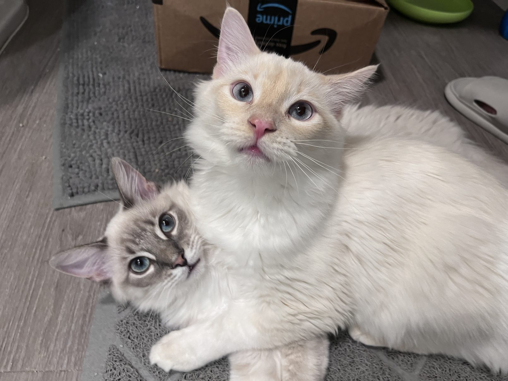

# Hi, I'm Zixiang Tong, or call me Zach 👋

🎓 **PhD student in Engineering Mechanics** at UT Austin   
🧪 Expanding **Digital Image/Volume Correlation (DIC/DVC)** technology under extremely challenging conditions  
🌍 Passionate about **measurement technologies, solid experimental mechanics**   

---

## 🚀 Featured Publications

### [3D Stereo Adaptive Mesh Augmented Lagrangian Digital Image Correlation (3D-ALDIC)](https://www.researchsquare.com/article/rs-5507109/v1)
- Developed an **advanced, robust, and user-friendly open-source stereo-DIC method** for high-accuracy 3D displacement measurement.  
- Focused on **complex geometry**, **large deformation**, and **complex real biological tissue** challenges.

### [Machine Learning-Aided Spatial Adaptation for Improved Digital Image Correlation Analysis of Complex Geometries](https://www.researchsquare.com/article/rs-5566473/v1)
- Presents a machine learning approach to improve Digital Image Correlation (DIC) analysis efficiency.
- Automates region selection, mesh refinement, and subset splitting near complex sample edges.

---

## 🚀 Ongoing Projects

### [Stereo-DIC Challenge 2.0](https://idics.org/challenge/)
- Our developed 3D-ALDIC method is participating in the Stereo-DIC Challenge 2.0.

### [DVC Challenges 2.0](https://idics.org/challenge/)
- I am currently serving as an assistant for DVC Challenge 2.0, focusing on coordination, data organization, and paper writing.

---

## 🎨 Fun Facts

- 🐱 Proud parent of two adorable kittens.
  

    
  

- 🎹 Recently started learning the **electronic piano**.  
- 🎮 Avid gamer who enjoys **Baldur's Gate 3**, **The Legend of Zelda**, **The Witcher 3**, and **Hollow Knight**.

---

## 📫 Get in Touch

- **LinkedIn**: [linkedin.com/in/ZixiangTong](https://www.linkedin.com/in/zixiang-tong-0606ba29a/)
- **ResearchGate**: [ResearchGate](https://www.researchgate.net/profile/Zixiang-Tong)
- **Google Scholar**: [Googlescholar](https://scholar.google.com/citations?user=6xlr4lsAAAAJ&hl=zh-CN&authuser=1)
- **Our group website**: [Yang group](https://sites.utexas.edu/yang/)
- **Email**: zachtong@utexas.edu

---
Thanks for visiting my profile! Feel free to explore my projects and reach out if you're interested in collaborating! ✨
