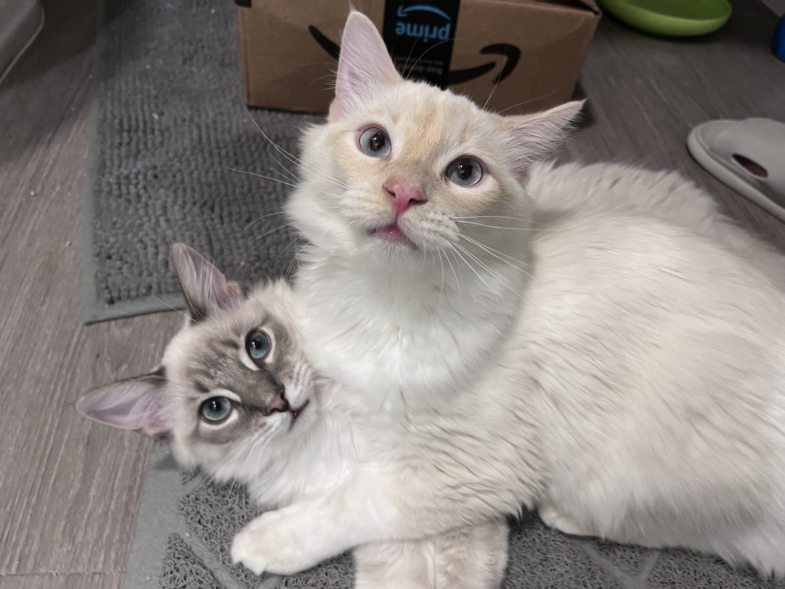
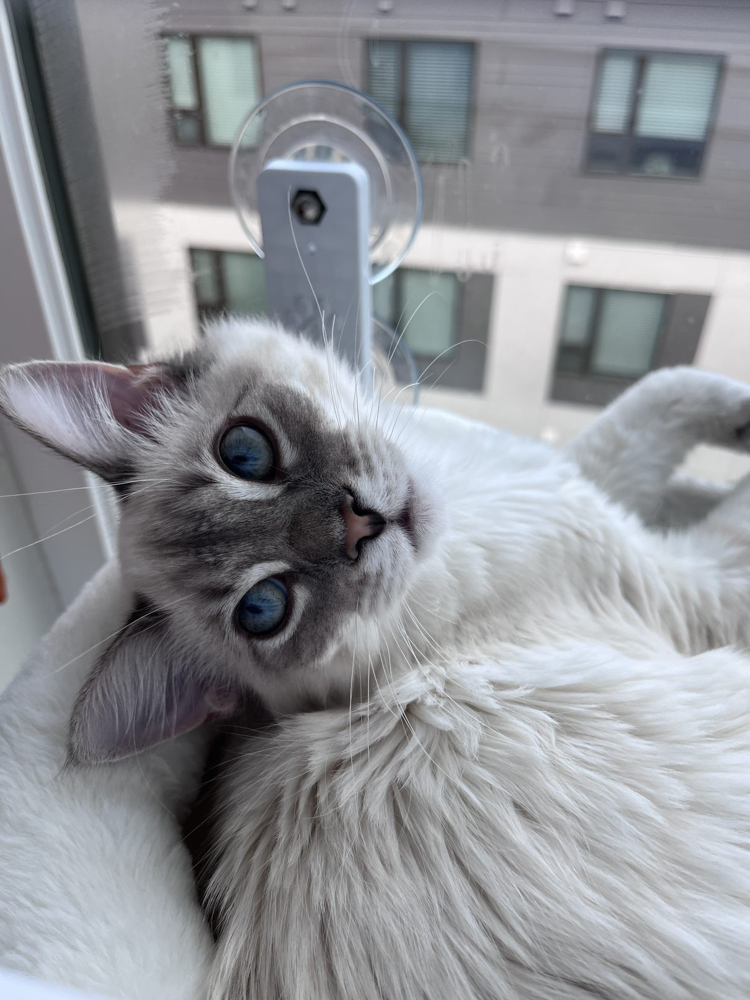

---

<table>
  <tr>
    <td width="65%">

**PhD student in Engineering Mechanics** at [The University of Texas at Austin](https://sites.utexas.edu/yang/), working in the Yang Research Group.

My research focuses on advancing **Digital Image/Volume Correlation (DIC/DVC)** under extremely challenging conditions — complex geometry, large deformation, and biological tissues. I combine **Machine Learning** and **Computer Vision** to build open-source tools that make high-accuracy deformation measurement accessible to the experimental mechanics community.

*When I'm not correlating pixels, I'm hanging out with my ragdoll cats* :point_right:

   </td>
    <td width="35%" align="center">
      
       
      <em>Lab supervisors (unofficial)</em>
    </td>
  </tr>
</table>

---

  <h3>Stereo-ALDIC: 3D Full-field Deformation Measurement</h3>
  

---

## Tech Stack

---

## Featured Publications

<table>
  <tr>
    <td>
      <strong><a href="https://doi.org/10.1007/s11340-025-01225-7">3D-ALDIC: Stereo Adaptive Mesh Augmented Lagrangian Digital Image Correlation</a></strong>
       
      
      
      
       
      An advanced, robust, and user-friendly open-source stereo-DIC method for high-accuracy 3D displacement measurement under complex geometry, large deformation, and biological tissue challenges.
    </td>
  </tr>
  <tr>
    <td>
      <strong><a href="https://www.researchsquare.com/article/rs-5566473/v1">Machine Learning-Aided Spatial Adaptation for Improved DIC Analysis of Complex Geometries</a></strong>
       
      
      
       
      A machine learning approach that automates region selection, mesh refinement, and subset splitting near complex sample edges for improved DIC analysis efficiency.
    </td>
  </tr>
</table>

---

## Open Source & Projects

| Project | Description | Status |
|---------|-------------|--------|
| [**3D-Stereo-ALDIC**](https://github.com/zachtong/3D-Stereo-ALDIC) | Open-source stereo-DIC for 3D full-field deformation measurement |  |
| [**RAFTcorr**](https://github.com/zachtong/RAFTcorr) | Deep learning DIC framework for dense displacement measurement |  |
| [**RAFT-DVC**](https://github.com/zachtong/RAFT-DVC) | A DVC-tailored RAFT framework |  |
| [**STAQ-DIC-GUI**](https://github.com/zachtong/STAQ-DIC-GUI) | Refactored and optimized STAQ-DIC with a GUI |  |
| [**2D_ALDIC**](https://github.com/zachtong/2D_ALDIC) | AL-DIC combining advantages of Local Subset and Global DIC |  |
| [**ALDVC**](https://github.com/zachtong/ALDVC) | Adaptive Lagrangian Digital Volume Correlation |  |
| [**STAQ-DIC**](https://github.com/zachtong/STAQ-DIC) | Spatiotemporally Adaptive Quadtree Mesh DIC for large deformations |  |
| [**3D_DVC_Dataset_Generator**](https://github.com/zachtong/3D_DVC_Dataset_Generator) | Synthetic DVC dataset generator |  |
| [**OpenCorr**](https://github.com/zachtong/OpenCorr) | C++ library for DIC/DVC development |  |

**Ongoing Challenges:**
- [**Stereo-DIC Challenge 2.0**](https://idics.org/challenge/) — Participating with 3D-ALDIC method
- [**DVC Challenge 2.0**](https://idics.org/challenge/) — Serving as assistant for coordination, data organization, and paper writing
- **ML-DIC** — Developing a machine learning-based DIC method

---

## Conference Presentations

**2025**
- **[iDICs 2025](https://web.cvent.com/event/549f7a26-038b-4e57-955f-00d8bf0572d2/summary)** (Alexandria, VA) — "RAFTcorr: An Open-Source, Deep Learning DIC Framework for Dense Displacement Measurement" | Nov 4-6
- **[TECHCON 2025](https://www.src.org/calendar/e007206/)** (Austin, TX) — "3D Stereo-ALDIC for High-Precision Full-field Deformation Characterization in Semiconductor Materials" | Sep 7-10
- **[SEM Annual 2025](https://sem.org/annual)** (Milwaukee, WI) — "3D Stereo-ALDIC" | Jun 2-5
- **[IMAC-XLIII 2025](https://sem.org/imac)** (Orlando, FL) — "Advancing Digital Image Correlation for Biomechanical Applications" | Feb 3-6

<strong>2024</strong>

 

- **[SEM Annual 2024](https://sem.org/ev_calendar_day.asp?date=2024-06-06&eventid=37)** (Vancouver, WA) — "Exploring the Interplay of Alveolar Mechanics and Fluid Accumulation in Pulmonary Edema: Insights from Soft Metamaterials 3D Printing and Mechanical Testing" | Jun 3-6
- **[Southern SEM Student Symposium 2024](https://sem.org/annual)** (Baton Rouge, LA) — "Exploring the Interplay of Alveolar Mechanics and Fluid Accumulation in Pulmonary Edema: Insights from Soft Metamaterial 3D Printing and Mechanical Testing" | May 12

---

## GitHub Activity

  
  

---

*Thanks for visiting! Feel free to explore my projects and reach out if you're interested in collaborating.*

Click here for a productivity boost

 

 
<em>Peer reviewer #2 taking a break</em>

 

